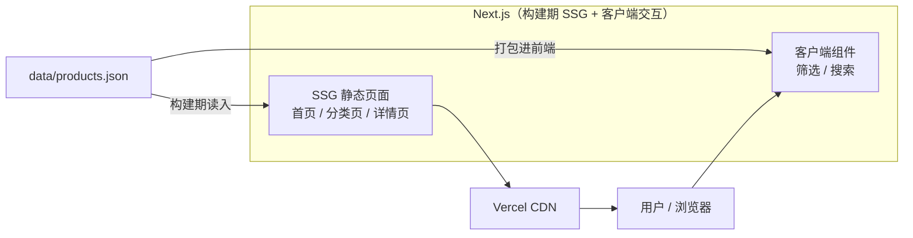
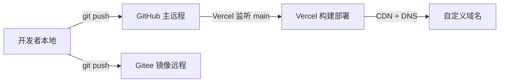

# AI Compass — 架构设计（ARCHITECTURE）

> 版本：v1.1 · 更新：2026-09-07

## 1. 总体架构

AI Compass 是一个**纯静态站点**：数据本地维护，构建期生成静态页面，筛选 / 搜索在浏览器端完成，无后端、无 Python。



## 2. 组件划分

| 组件 | 职责 | 位置 |
|---|---|---|
| 静态页面（SSG） | 首页列表、分类页、产品详情页（SEO） | `src/app/` |
| UI 组件 | 产品卡片、分类筛选、搜索栏等可复用组件 | `src/components/` |
| 数据访问层 | 读取 `products.json`、类型定义、筛选 / 搜索纯函数 | `src/lib/` |

## 3. 数据流

1. 开发者人工维护 `data/products.json`（唯一数据源）
2. Next.js 构建期读入数据，SSG 生成首页、分类页、产品详情页的静态 HTML
3. 数据同时打包进前端，客户端组件在浏览器内完成筛选 / 搜索（无网络请求）
4. 用户点击产品跳转官网（新标签页）

## 4. 目录结构树

```
AICompass/
├── specs/                      # 规格文档
│   ├── PRD.md
│   ├── SPEC.md
│   ├── ARCHITECTURE.md
│   └── API.md                  # 数据模型与数据访问
├── src/                        # Next.js 前端源码（App Router）
│   ├── app/
│   │   ├── layout.tsx          # 根布局
│   │   ├── page.tsx            # 首页（产品列表）
│   │   ├── globals.css
│   │   └── products/[slug]/
│   │       └── page.tsx        # 产品详情页
│   ├── components/             # 可复用 UI 组件
│   │   ├── product-card.tsx
│   │   ├── product-explorer.tsx  # 筛选 + 搜索的客户端容器
│   │   ├── category-filter.tsx
│   │   └── search-bar.tsx
│   └── lib/
│       ├── products.ts         # 数据访问 + 筛选搜索纯函数
│       └── types.ts            # Product/Category 类型 + 分类映射
├── data/
│   └── products.json           # 产品数据（唯一数据源）
├── public/                     # 静态资源（logo、图标）
├── package.json
├── tsconfig.json
├── tailwind.config.ts
├── next.config.mjs
├── .gitignore
├── .editorconfig
└── README.md
```

## 5. 部署拓扑



1. 代码推送到 GitHub `main`（`origin`），同时推送到 Gitee（`gitee`）
2. Vercel 关联 GitHub 仓库，监听 `main` 分支自动构建部署
3. 在 Vercel 绑定已购域名，配置 DNS（CNAME / A 记录指向 Vercel）
4. Gitee 作为国内访问镜像，不参与部署

## 6. 关键决策（ADR 式记录）

### ADR-001：采用纯静态、无后端架构

- **背景**：需求为「AI 产品导航站」，数据读多写少、接近静态；用户明确「只做收集 + 跳转，不用 Python 和后端」。
- **决策**：纯静态站 —— 数据用 `products.json` 维护，Next.js SSG 生成静态页，筛选 / 搜索在客户端完成。
- **结果**：无需后端、无需 Python / conda，部署最简单（Vercel 纯静态），同时覆盖全部 MVP 功能。
- **演进路径**：若后续需「用户提交 / 动态写入」，可再引入后端（如 FastAPI + Railway），前端数据来源替换为接口即可。
